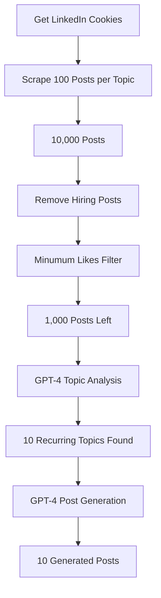

# LinkedIn Post Automation

Automates the process of scraping LinkedIn posts, filtering them, and generating new content based on trending topics. It uses Selenium for web scraping, OpenAI's GPT-4 for content generation.

## Project Flow




### Detailed Flow:
1. **Initial Setup**
   - Get LinkedIn cookies for authentication
   - Load top 100 categories from `top-100-categories-linkedin.json`

2. **Data Collection**
   - Scrape 100 posts for each of the 100 categories
   - Total: ~10,000 posts collected
   - Output saved to `all_categories_posts.csv`

3. **Content Filtering**
   - Remove hiring-related posts using `hiring-post-indicator-words.json`
   - Filter posts based on minimum likes threshold
   - Truncate posts longer than 200 words
   - Remove duplicate content
   - Result: ~1,000 high-quality posts

4. **Content Generation**
   - Analyze filtered posts to identify top 10 recurring topics
   - Generate detailed descriptions for each topic
   - Create 10 unique LinkedIn posts based on these topics
   - Save generated posts with timestamps

## Setup

1. **Install Dependencies**
   ```bash
   pip install -r requirements.txt
   ```

2. **Environment Variables**
   Create a `.env` file with the following variables:
   ```
   # Scraping Configuration
   NUM_CATEGORIES=100
   POSTS_PER_CATEGORY=100
   OUTPUT_FILE=all_categories_posts.csv
   FILTERED_POSTS=filtered_posts.csv
   LIKES_FILTER=10

   # OpenAI Configuration
   OPENAI_API_KEY=your_api_key_here
   OPENAI_MODEL=gpt-4
   OPENAI_TEMPERATURE=0.7
   ```

3. **LinkedIn Authentication**
   - Get your LinkedIn cookies
   - Save them in `cookies.json`

## Usage

Run the complete process:
```bash
python run_scraper.py
```

Choose from two options:
1. Run full process (scrape + filter + generate)
2. Generate posts from existing filtered_posts.csv

## Output Files

- `all_categories_posts.csv`: Raw scraped posts
- `filtered_posts.csv`: Posts after filtering
- `generated_posts/posts_[timestamp].txt`: Generated LinkedIn posts

## Project Structure

```
├── scrape-all-categories.py    # Main scraping script
├── scrape.py                   # Core scraping functions
├── filter-posts.py            # Post filtering logic
├── generate-posts-using-trending.py  # Content generation
├── run_scraper.py             # Main execution script
├── requirements.txt           # Project dependencies
├── .env                       # Configuration variables
├── cookies.json              # LinkedIn authentication
├── hiring-post-indicator-words.json  # Hiring filter words
└── top-100-categories-linkedin.json  # Category list
```

## Features

- Automated LinkedIn post scraping
- Smart filtering of hiring posts
- Engagement-based filtering (likes)
- Content length optimization
- Duplicate removal
- Topic analysis using GPT-4
- Automated post generation
- Timestamped output files

## Notes

- Ensure you have valid LinkedIn cookies
- Respect LinkedIn's rate limits
- Monitor API usage for OpenAI
- Generated posts are saved in the `generated_posts` directory
- Each run creates a new timestamped file for generated posts

## Error Handling

The script includes error handling for:
- Network issues during scraping
- Invalid cookies
- API rate limits
- File I/O operations
- Data parsing errors
